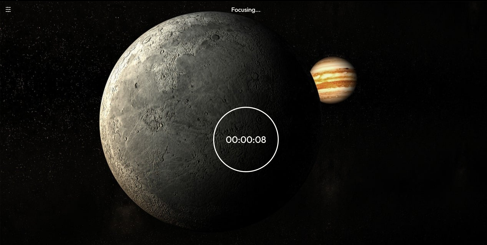

# Flowency

Flowency is a productivity desktop app which workes on the flowtime technique in which the duration of your break depends on the duration of work that you did.

- Under 25 minutes of work - 5 Minute Break
- 25 to 50 minutes of work - 8 Minute Break
- 50 to 90 minutes of work - 10 Minute Break
- More than 90 minutes of work - 15 Minute Break

## Technologies Used

- Tauri
- VueJS
- Pixabay API

## AI Usage

No AI was used in the making of this app.

## Screenshot

